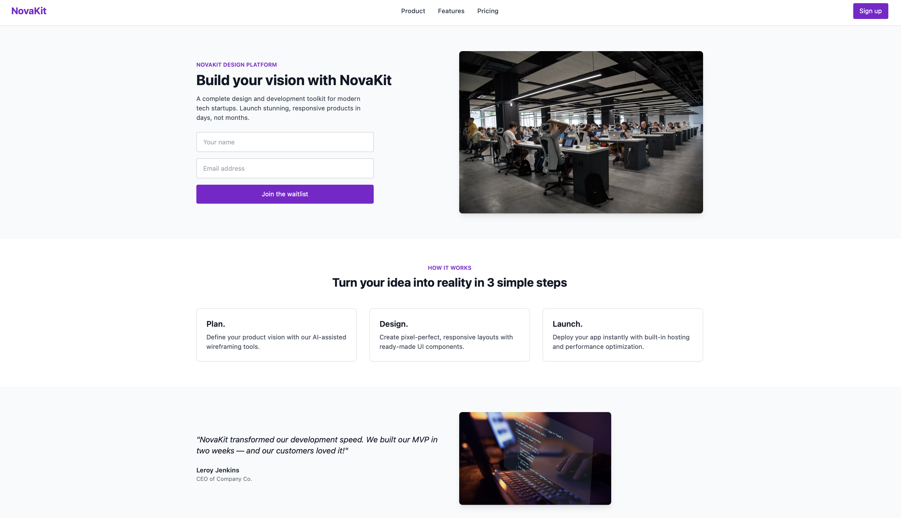
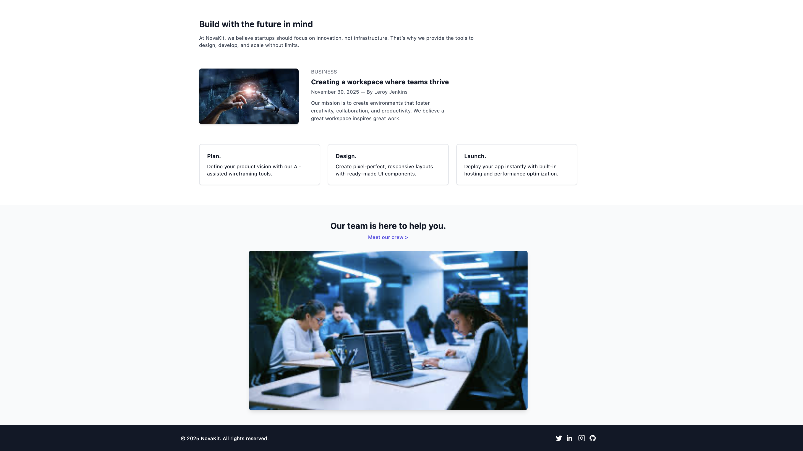

# NovaKit Landing Page

Bu proje, Tailwind CSS kullanılarak oluşturulmuş modern ve responsive bir landing page örneğidir. NovaKit adlı hayali bir teknoloji startup'ı için tasarlanmıştır.

## Proje Hakkında

Bu sayfa, kullanıcı dostu ve sade tasarımı ile startup'ların ürünlerini hızlıca tanıtmaları için hazırlanmıştır. Tailwind CSS kullanarak tüm bölümler esnek ve mobil uyumlu şekilde tasarlanmıştır.

## Projede Yapılanlar

1. **Navbar:**  
Sayfanın üstünde yer alan sabit menü. Logo, sayfa içi bağlantılar ve sağda “Sign up” butonu bulunmaktadır. `flex` yapısı ile yan yana hizalandı.

2. **Hero Bölümü:**  
Sayfanın en dikkat çekici alanı. Büyük başlık, açıklama metni ve kullanıcı adı + e-posta içeren form bulunur. Görsel ve form `flex` ile yan yana düzenlendi.

3. **Özellikler Bölümü:**  
“HOW IT WORKS” başlığı altında 3 adımda ürünün nasıl çalıştığını anlatan kutular yer alıyor. Her kutu başlık ve kısa açıklama içerir. `grid` yapısı ile düzenlendi.

4. **Testimonial Bölümü:**  
Müşteri yorumları için özel alan. Müşteri sözü, ismi ve pozisyonu yer alır. Tasarımda okunabilirliği artırmak için renk ve yazı stilleri kullanıldı.

5. **Blog / Haber Bölümü:**  
Güncel içeriklerin gösterildiği alan. Sol tarafta büyük bir başlık ve açıklama, altına görsel; sağ tarafta ise blog kartı ve alt bilgi kutucukları yer alır. Görsel ve metin `flex` ile yanyana hizalandı.

6. **Takım Bölümü:**  
Takım üyelerinin tanıtıldığı kısım. Başlık ve “Meet our crew >” alt yazısı ile birlikte, ekip fotoğrafları görsel olarak eklenir.

7. **Footer:**  
Sayfa sonunda yer alan telif hakkı bilgisi ve sosyal medya ikonları barındırır. İkonlar hover efektleriyle interaktif hale getirildi.

## Kullanılan Teknolojiler

- HTML5
- Tailwind CSS (CDN)
- SVG ikonlar (sosyal medya)

# NovaKit Landing Page

...

## Görseller

Linkten ulaşabilirsiniz
https://fnuryigit.github.io/TailwindCSS_LandingPage/

